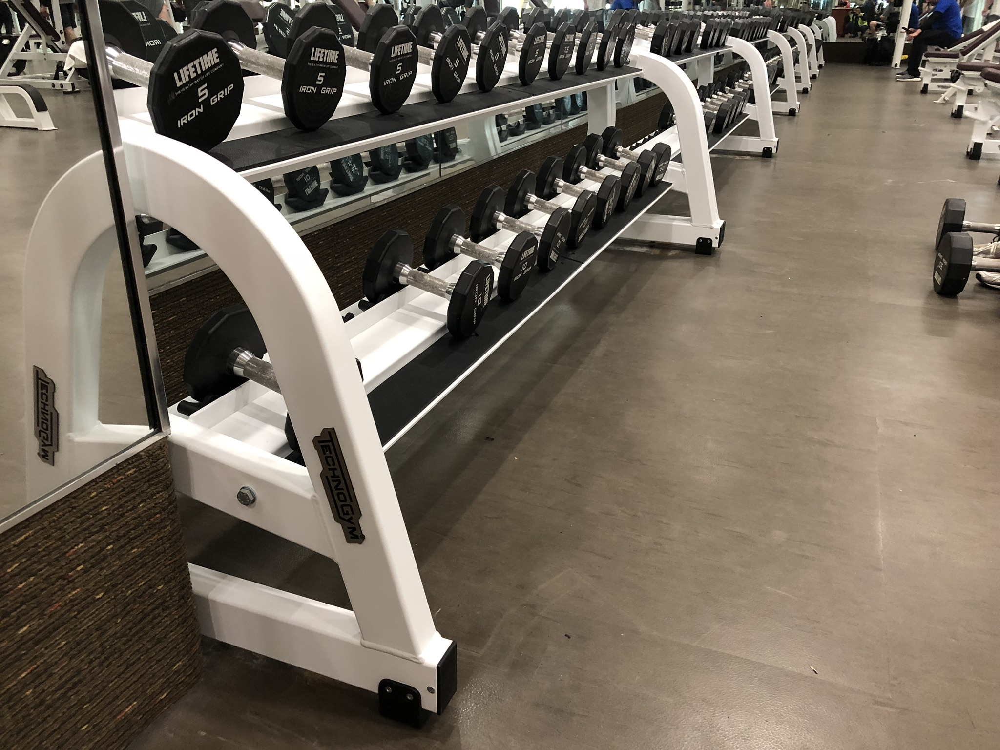
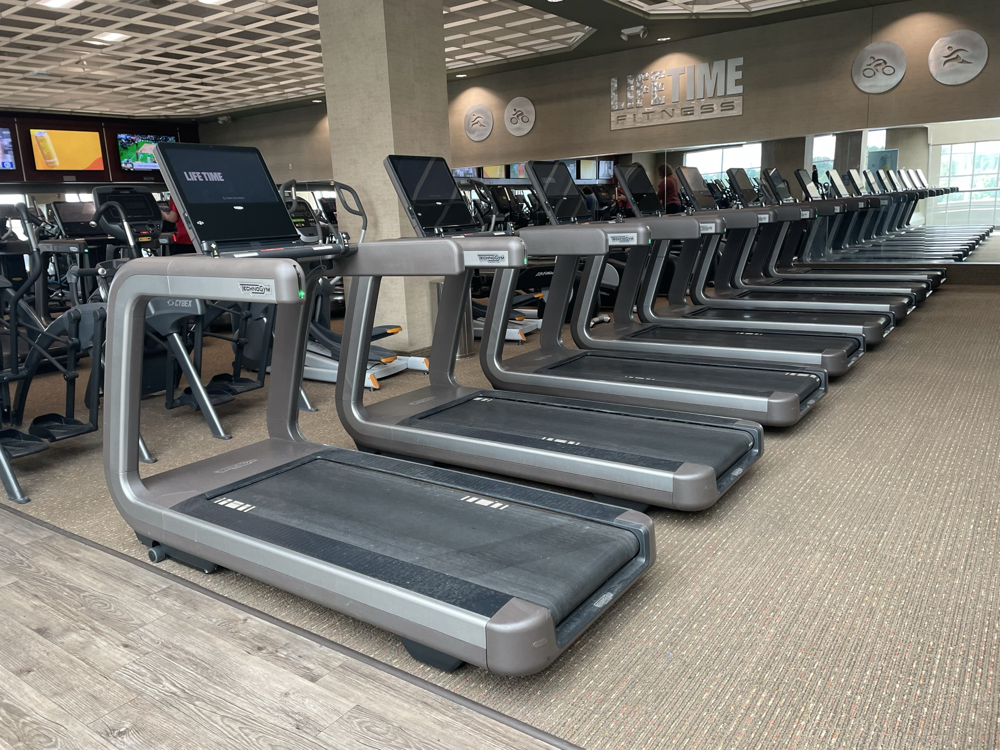
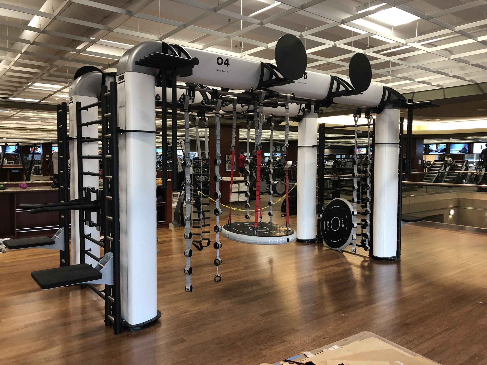
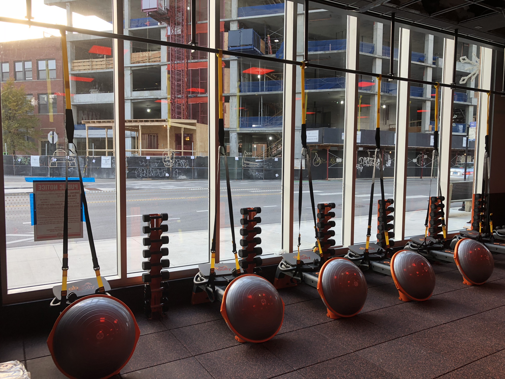
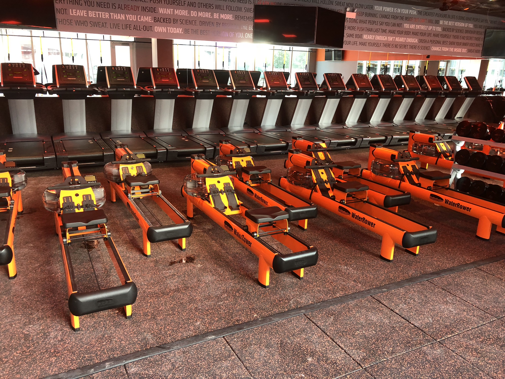
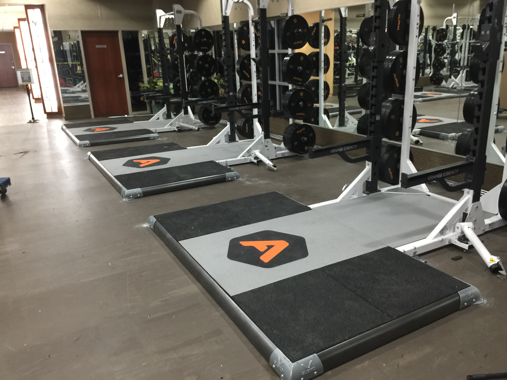
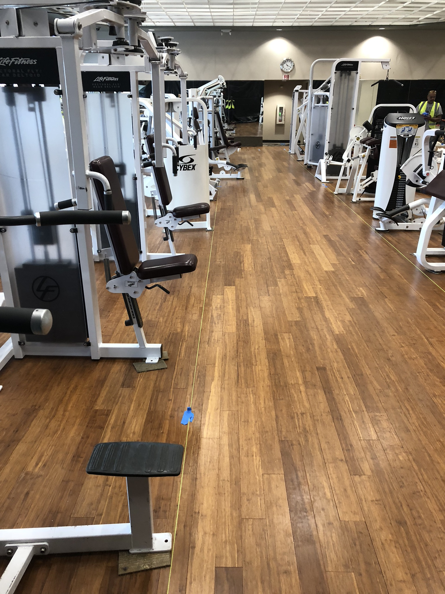

# shawnloiseau1.github.io
<!DOCTYPE html>
<html lang="en">
<head>
  <meta charset="UTF-8" />
  <meta name="viewport" content="width=device-width, initial-scale=1.0" />
  <title>Shawn Loiseau | Operations & Logistics Leader</title>
  <link rel="preconnect" href="https://fonts.googleapis.com" />
  <link rel="preconnect" href="https://fonts.gstatic.com" crossorigin />
  <link href="https://fonts.googleapis.com/css2?family=Inter:wght@300;400;500;600;700;800;900&family=Space+Grotesk:wght@400;500;600;700&display=swap" rel="stylesheet" />
  
</head>
<body>

  <!-- ─── NAV ───────────────────────────────────────────────────── -->
  <nav id="navbar">
    <a href="#" class="nav-logo">S.L</a>
    <ul class="nav-links">
      <li><a href="#about">About</a></li>
      <li><a href="#experience">Experience</a></li>
      <li><a href="#skills">Skills</a></li>
      <li><a href="#gallery">Portfolio</a></li>
      <li><a href="#education">Education</a></li>
      <li><a href="#contact" class="nav-cta">Contact</a></li>
    </ul>
  </nav>

  <!-- ─── HERO ──────────────────────────────────────────────────── -->
  <section class="hero" id="home">
    

    

      
Operations &amp; Logistics Leader

      <h1>Shawn Loiseau</h1>
      

        10+ years driving operational excellence across fitness technology,
        logistics, P&amp;L management, and elite team leadership.
      

      

        <a href="#experience" class="btn btn-primary">View Experience</a>
        <a href="#contact" class="btn btn-outline">Get In Touch</a>
      

    

    

      

        
10+

        
Years Experience

      

      

        
4

        
Major Roles

      

      

        
3

        
Premium Brands

      

    

  </section>

  <!-- ─── ABOUT ─────────────────────────────────────────────────── -->
  <section id="about">
    

      
About Me

      <h2>Built on Precision, Driven by Results</h2>
    

    

      

        

          <strong>Results-driven Operations and Logistics Leader</strong> with over 10 years of
          progressive experience spanning the fitness industry — including high-end equipment
          installation, technical training, consultative sales, and comprehensive operational
          management with full P&amp;L oversight.
        

        

          Critical technical proficiency in maintaining and quality-assuring commercial fitness
          technology from premium brands like <strong>Technogym, Life Fitness, and Precor</strong>.
          Expert in leading teams, ensuring <strong>DOT and safety compliance</strong>, and
          optimizing facility performance to deliver a reliable, premium, resort-style
          member experience.
        

        

          Bilingual in <strong>English and Spanish</strong>, with proven ability to communicate
          effectively across all levels of an organization and with diverse client bases.
        

        

          

            
&#9881;

            
P&amp;L Oversight

            
Full financial performance management

          

          

            
&#128200;

            
KPI Tracking

            
Scorecard &amp; performance metrics

          

          

            
&#128101;

            
Team Leadership

            
Training, onboarding &amp; retention

          

          

            
&#9989;

            
Quality Assurance

            
In-process &amp; final QC protocols

          

        

      

      

        
        

          
10+

          
Years in the Field

        

      

    

  </section>

  <!-- ─── EXPERIENCE ────────────────────────────────────────────── -->
  <section id="experience">
    

      
Work History

      <h2>Key Experience</h2>
      
A track record of leadership, technical expertise, and measurable impact across top-tier organizations.

    

    

      

        

        

          

            

              
Sales Associate, Wellness Consulting

              
Vitamin World

              
Rosemont, IL

            

            
Nov 2023 — Present

          

          <ul class="job-bullets">
            <li><strong>Consultative Sales:</strong> Consistently provided exceptional customer service as a wellness consultant, offering personalized product recommendations to maximize sales and meet individual customer needs.</li>
            <li><strong>Retail Operations:</strong> Managed inventory, stocked shelves, and maintained organization and visual display of the sales floor to enhance the customer shopping experience.</li>
          </ul>
        

      

      

        

        

          

            

              
Manager, Operational Excellence

              
J.B. Hunt

              
Melrose Park, IL

            

            
May 2022 — Jun 2023

          

          <ul class="job-bullets">
            <li><strong>Operational &amp; Financial Oversight:</strong> Responsible for complete P&amp;L performance, including cost control decisions, expense management, and maximizing profitability for assigned operations.</li>
            <li><strong>Process Optimization:</strong> Trained, audited, and improved standard operating procedures to enhance daily proficiency and streamline workflow processes.</li>
            <li><strong>Leadership &amp; Compliance:</strong> Oversaw all aspects of operations, focusing on safety, compliance, employee scorecard management, and driver retention.</li>
          </ul>
        

      

      

        

        

          

            

              
Lead Trainer &amp; Fitness Technology Specialist

              
Mass Movement Inc. / J.B. Hunt

              
Melrose Park, IL

            

            
Aug 2019 — May 2022

          

          <ul class="job-bullets">
            <li><strong>Expert Equipment Training:</strong> Developed and implemented comprehensive training programs for technical staff on the assembly, installation, and SOPs for high-end fitness equipment — Technogym, Life Fitness, Precor, and Stages.</li>
            <li><strong>Quality Assurance:</strong> Led quality control protocols, testing gym equipment at all stages of production to ensure strict conformity to manufacturer specifications, directly impacting user safety and product reliability.</li>
            <li><strong>Process Improvement:</strong> Implemented continual education programs, significantly reducing installation errors and improving the efficiency of field service teams.</li>
          </ul>
        

      

      

        

        

          

            

              
Installation &amp; Quality Control Lead

              
Mass Movement Inc. / J.B. Hunt

              
Melrose Park, IL

            

            
Sep 2017 — Aug 2019

          

          <ul class="job-bullets">
            <li><strong>Field Management:</strong> Directed 4–5 member installation teams as the primary onsite customer contact, coordinating and resolving all installation and delivery issues through to completion.</li>
            <li><strong>Technical Assembly:</strong> Led the proper assembly, functional testing, and installation of complex gym equipment per manufacturer specifications and local codes — ensuring zero damage to product and customer locations.</li>
            <li><strong>Safety &amp; Logistics:</strong> Ensured safe, secure, and timely transportation of high-value goods, adhering to DOT and strict internal safety compliance standards.</li>
          </ul>
        

      

    

  </section>

  <!-- ─── SKILLS ────────────────────────────────────────────────── -->
  <section id="skills">
    

      
Capabilities

      <h2>Skills &amp; Expertise</h2>
    

    

      

        
&#128200;

        
Operational Management

        
P&amp;L oversight, KPI tracking, and full operational performance ownership

      

      

        
&#9881;

        
Fitness Equipment Technology

        
Maintenance, QC, and installation for Technogym, Life Fitness &amp; Precor

      

      

        
&#128172;

        
Consultative Sales

        
Customer-first approach to sales with personalized recommendations

      

      

        
&#128101;

        
Team Leadership &amp; Training

        
Onboarding, coaching, retention, and field team management

      

      

        
&#9989;

        
Quality Control &amp; Assurance

        
In-process and final QC protocols against manufacturer specifications

      

      

        
&#127760;

        
Bilingual — English &amp; Spanish

        
Full professional proficiency in both languages

      

      

        
&#128667;

        
DOT Compliance &amp; Safety

        
Transportation safety, Non-CDL Class C, and regulatory adherence

      

      

        
&#128260;

        
Process Optimization

        
SOP development, auditing, and continual improvement programs

      

    

  </section>

  <!-- ─── GALLERY ───────────────────────────────────────────────── -->
  <section id="gallery">
    

      
Portfolio

      <h2>Work in the Field</h2>
      
A selection of commercial fitness facility installations showcasing technical expertise across premium brands and venues.

    

    

      

        
        

          

            Technogym &bull; Life Time Fitness
            Treadmill row installation &amp; alignment
          

        

      

      

        
        

          

            Functional Training Rig
            Multi-station cable system setup
          

        

      

      

        
        

          

            Technogym &bull; Life Time Fitness
            Dumbbell rack installation &amp; staging
          

        

      

      

        
        

          

            Suspension &amp; Functional Training
            TRX &amp; stability station configuration
          

        

      

      

        
        

          

            Cardio Suite
            Rowing machine installation &amp; QC
          

        

      

      

        
        

          

            Hammer Strength
            Power rack &amp; platform installation
          

        

      

      

        
        

          

            Life Fitness &bull; Cybex
            Selectorized strength equipment setup
          

        

      

    

  </section>

  <!-- ─── EDUCATION ─────────────────────────────────────────────── -->
  <section id="education">
    

      
Education &amp; Credentials

      <h2>Qualifications</h2>
    

    

      

        
&#127891;

        
GED

        
Timothy Christian High School

        
Elmhurst, IL &mdash; January 2009

      

      

        
&#128667;

        
Non-CDL Class C

        
Commercial Driver License

        
DOT compliance &amp; safety certified

      

      

        
&#127760;

        
Bilingual

        
English &amp; Spanish

        
Full professional proficiency

      

      

        
&#9881;

        
Fitness Tech Specialist

        
Technogym &bull; Life Fitness &bull; Precor

        
Assembly, installation &amp; QC certification

      

    

  </section>

  <!-- ─── CONTACT ───────────────────────────────────────────────── -->
  <section id="contact">
    

      
Get In Touch

      <h2>Let's Connect</h2>
    

    

      

        
Available for New Opportunities

        <h3>Ready to Make an Impact</h3>
        
With 10+ years of hands-on experience in operations, logistics, and fitness technology, I bring both strategic leadership and ground-level expertise to every role.

        <a href="mailto:shawn.loiseau1@gmail.com" class="btn btn-primary">Send an Email</a>
      

    

  </section>

  <!-- ─── FOOTER ────────────────────────────────────────────────── -->
  <footer>
    
&copy; 2025 Shawn Loiseau. All rights reserved.

  </footer>

  <!-- ─── LIGHTBOX ──────────────────────────────────────────────── -->
  

    <button class="lightbox-close" onclick="closeLightbox()">&times;</button>
    
  

  <!-- ─── SCRIPTS ───────────────────────────────────────────────── -->
  
</body>
</html>
